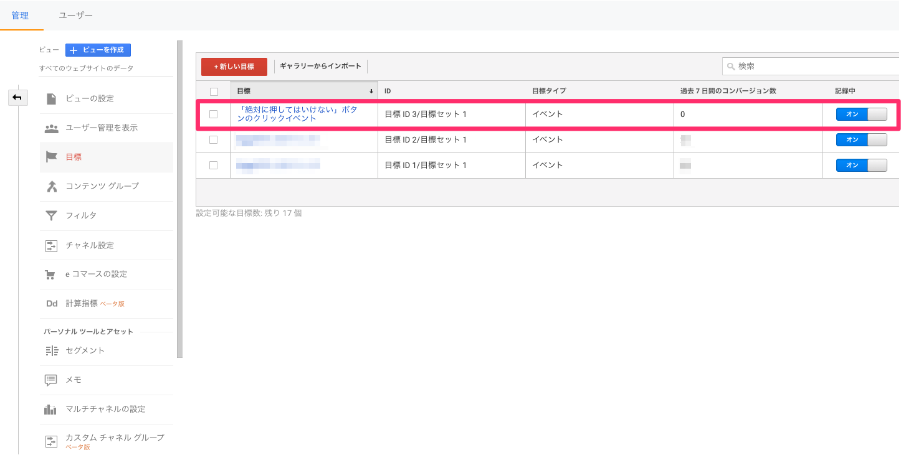
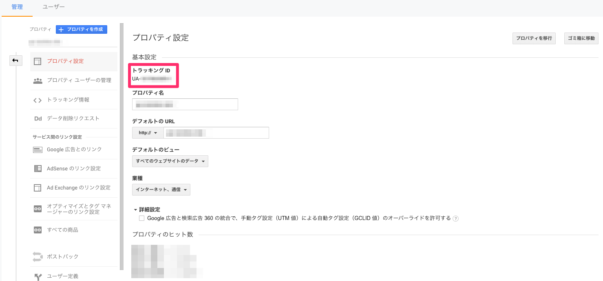
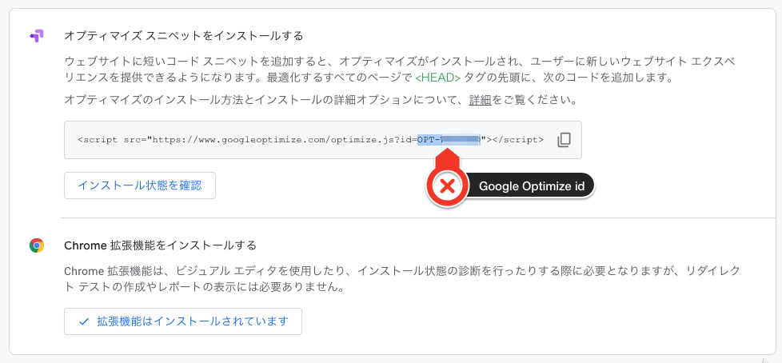
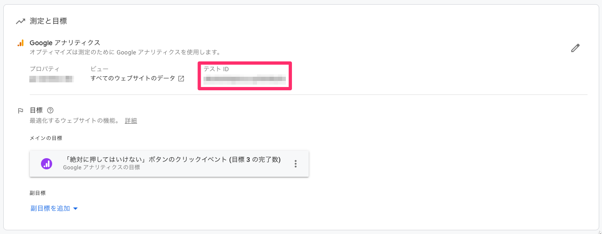

# google-optimize-react-ssr-sample

Google OptimizeをReactのSSR時に利用するサンプル

## package.json - scripts

```json
{
    "clean": "開発環境をクリーンにします",
    "build": "成果物を作成するためにビルドをします",
    "develop": "開発用のwatcherが起動します",
    "develop:server": "開発サーバーが起動します",
    "tsc:build": "TypeScriptのビルドが実行されます",
    "tsc:build:watch": "TypeScriptのビルドwatcherが起動します",
    "docker:build": "Dockerのイメージを作成します",
    "docker:server": "作成したDockerイメージを起動します",
    "webpack:build": "クライアントで利用する成果物を生成します"
}
```

## Usage

* `src/config.ts`にGoogle OptimizeとGoogle Analyticsのパラメーターを入力してください。

## 構成

```
src/
├── App.tsx       // <body>に描画するHTMLコンポーネント
├── Optimize.ts   // Google Optimize用のvariationインターフェース
├── Template.tsx  // <body>以外を描画するHTMLコンポーネント
├── client.tsx    // ブラウザ用JSののエントリーポイント
├── config.ts     // アプリケーションのパラメーター
├── server.tsx    // サーバーサイドのエントリーポイント
└── share.ts      // サーバーとクライントで共有するパラメーターのインターフェース
```

## Google Analyticsの設定

* <http://analytics.google.com/analytics/web/>

### 目標の指定



### Tracking IDの取得



## Google Optimize

* <https://optimize.google.com/optimize/home/>

### Tracking IDの取得



### テストIDの取得



* Google Analyticsとリンクすることで発行されます。
* エクスペリエンス単位で発行されます。

## License

MIT [@Himenon](http://himenon.github.io/)
